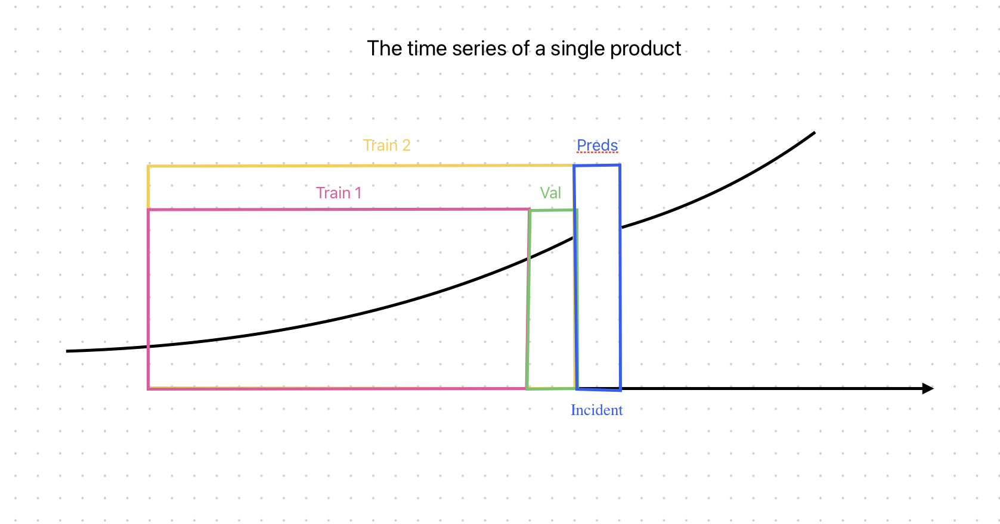

# 6. Validation Scheme

The validation scheme for a single product will be as follows:

We allocate a validation set that is time-equivalent to the duration of the incident. We train our model or calculate the baseline heuristic on **Train 1**. **Train 1** represents a dataset with revenue from a period prior to validation (the size will be determined experimentally). Validation will be used as the basis for tuning the hyperparameters of ML models. We then combine **Train 1** and **Val**, train a new model, and then obtain predictions on the incident data. As a proxy metric, we use the performance indicators on **Val**.

# 7. Baseline Models Development

## Naive Prediction by Averaging

This approach involves using the average target value from a previous time period equal to the downtime or several periods within the sales seasonality of the product.

**Example:** Product A was partially unavailable because some users couldn't access the payment service from 12:00 to 15:00 on Tuesday. Our baseline suggests using the average sales of this product during this time on Tuesdays over the past three weeks (as an example). We subtract the actual revenue obtained from this average to determine our losses.

## ARIMA and sARIMA Models

ARIMA (AutoRegressive Integrated Moving Average) models are used as an initial application of machine learning due to their simplicity in use.

## Prophet

This forecasting tool is useful for time series data and incorporates seasonal effects and trends.

## Linear Regression

Starting with linear models, we can further engage in feature engineering, which requires additional effort but may improve model performance.

## Gradient Boosting

By creating features such as past sales (averages, moving windows with mean, median, minimum, maximum calculations), sales frequency, and historical service prices, we can use gradient boosting on trees to achieve good model accuracy.

## Recurrent Neural Networks (RNN, GRU, LSTM)

Recurrent neural networks (GRU and LSTM) can be tested if needed, though they require more development time and computational resources.

## Transformers

If previous models indicate that neural network approaches are worthwhile, transformers can be tested for solving our task.
